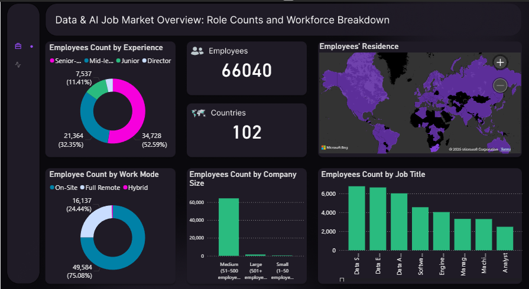

# Data & AI Job Market Overview

## Project Overview
This project analyzes **136,000+ rows** of global workforce and salary data for Data & AI-related roles.  
The goal was to uncover patterns in hiring trends, experience levels, salaries, and work modes across **102 countries**.

**Tools Used:** PostgreSQL, Power BI

---

---

## Key Insights

### Workforce Distribution
- **Experience Level:** Senior (52.59%), Mid-level (32.35%), Junior (11.41%)
- **Work Mode:** On-site (75.08%), Fully Remote (24.44%), Hybrid (0.47%)
- **Company Size:** Majority work in mid-sized companies (51–500 employees)

### Salary Analysis
- **Average Salary:** $151,165  
- **Max Salary:** $800,000  
- **Min Salary:** $15,000
- Yearly Trend: $102K (2020) → $152K (2024) → slight dip in 2025
- By Employment Type:
  - Full-Time: $151,796  
  - Contract: $101,798  
  - Part-Time: $80,393  
  - Freelance: $50,652
- By Work Mode:
  - On-Site: $152,315  
  - Remote: $149,007  
  - Hybrid: $81,532

### Top 5 Highest Paying Roles
1. Research Team Lead — $450,000  
2. Analytics Engineering Manager — $399,880  
3. Data Science Tech Lead — $375,000  
4. Applied AI/ML Lead — $292,500  
5. IT Enterprise Data Architect — $284,090  

---

## Business Recommendations
- Companies should focus on **remote-friendly** policies for mid and senior-level talent to stay competitive.
- Hybrid roles appear undervalued — an opportunity to restructure pay to attract talent.

---

## **Project Files**  
- [Power BI Dashboards](Power_BI/Power_BI_Report.pbix)
- [PostgreSQL Code](PostgreSQL_Queries.sql)
