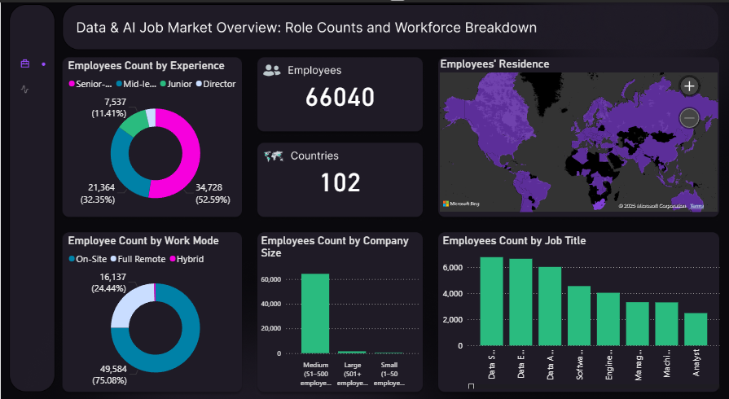

# Salaries Analysis

## Cleaned and organized more than 136,000 rows of raw data using PostgreSQL
## Built interactive dashboards with Power BI

## Data & AI Job Market Overview

### Workforce Insights
- **Total Employees Analyzed**: **66,040**
- **Global Representation**: Employees from **102 countries**
- **Top Experience Level**:  
  - **Senior-level**: 52.59%  
  - **Mid-level**: 32.35%  
  - **Junior**: 11.41%

### Work Mode Distribution
- **On-Site**: 75.08%  
- **Fully Remote**: 24.44%  
- **Hybrid**: 0.47%

### Company Size Distribution
- Most employees (> 64,000) work in **medium-sized companies (51–500 employees)**

### Top Job Titles by Count
1. **Data Scientist**
2. **Data Engineer**
3. **Data Analyst**
4. **Software Engineer**
5. **Engineer**

---

## Salary Analysis: Trends & Distribution

### Salary Overview
- **Average Salary**: `$151,164.94`
- **Max Salary**: `$800,000`
- **Min Salary**: `$15,000`

### Yearly Salary Trend
- **2020**: ~$102K  
- **2021**: ~$99K (sharp increase)
- **2022**: ~$131K  
- **2023**: ~$150K  
- **2024**: ~$152K  
- **2025**: ~$151K (slight dip)

### Salary by Employment Type
- **Full-Time**: `$151,795.6`
- **Contract**: `$101,797.84`
- **Part-Time**: `$80,392.71`
- **Freelance**: `$50,651.56`

### Salary by Work Mode
- **On-Site**: `$152,315.18`
- **Full Remote**: `$149,007.11`
- **Hybrid**: `$81,532.05`

### Top 5 Jobs by Average Salary

| Job Title                     | Avg. Salary |
|-------------------------------|-------------|
| Research Team Lead            | $450,000    |
| Analytics Engineering Manager | $399,880    |
| Data Science Tech Lead        | $375,000    |
| Applied AI/ML Lead            | $292,500    |
| IT Enterprise Data Architect  | $284,090    |

## **View the Project**  
- [Power BI Report](Power_BI/Power_BI_Report.pbix)
- [Excel Analysis](Bike_Buyers_Excel.xlsx)
- [PostgreSQL Code](Bike_Buyers_SQL.sql)
